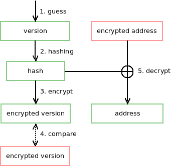
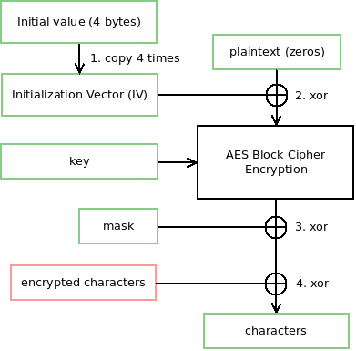

# wz

A C library can read \*.wz files.

## Environment

* Supported Platforms: Windows and \*nix
* Supported Compilers: >= GCC 3.1 or >= MSVC 12 (Visual Studio 2013)
* Dependencies: zlib
* Development Dependencies: check
* Using C Standard Revision: C99

## Getted Started

#### Windows

    > mkdir build && cd build
    > cmake
        -DCMAKE_INSTALL_PREFIX="X:\path\to\install"
        -DZLIB_ROOT="X:\path\to\zlib"
        -DCHECK_ROOT_DIR="X:\path\to\check"
        -G "Visual Studio 12" ..

Open `build\wz.sln` and build the project

#### \*nix

    $ mkdir build && cd build
    $ cmake .. && make && sudo make install

## Unit Test

    $ ctest

## Documentation

### Reading from wz file

[Tutorial](https://github.com/xsoameix/wz/wiki/Reading-from-wz-file)

### Decryption

There are two things in wz file is encrypted: the **address** and **characters**. The **address** is used to specify where the child nodes located. The **characters** have several usages and used in different places.

The **characters** can be
* *the node name*
* *the variable name*
* *the value of string variable*
* *the object type name*
* *the path of uol object*.

After **characters** were decrypted, the **characters** would be *UTF-16LE* encoded string.

The following figures describe how to decrypt the **address** and **characters**.

* Red color means this value is in wz file.
* Green color means this value is generated by ourself.
* Black color means this is a procedure.

**Address Decryption**:

**Characters Decryption**:

## Reference

* [Golang](https://github.com/diamondo25/go-wz/blob/master/directory.go)
* [C](https://code.google.com/p/cmsc/source/browse/trunk/wzlibc/wzlibc.c)
* [C++](https://github.com/NoLifeDev/NoLifeStory/blob/master/src/wz/wzmain.cpp)
* [C#](https://github.com/haha01haha01/MapleLib/blob/master/WzLib/WzFile.cs)
* [C#](https://github.com/Kagamia/WzComparerR2/blob/master/WzComparerR2.WzLib/Wz_Sound.cs)
* [C#](https://github.com/angelsl/ms-reWZ/blob/master/WZProperties/WZAudioProperty.cs)
