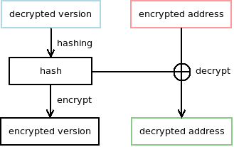
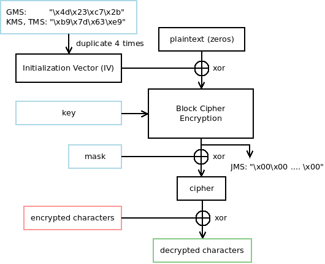

# WZlib

## Development

### Compile

```shell
$ mkdir bin && cd bin
$ cmake .. && make
```

### Run

```shell
$ ./src/wz /path/to/file.wz
```

### Unit Test

```shell
$ ctest .
```

## Documentation

### Version Encrytion



### Characters Encrytion



## Reference

* [Golang](https://github.com/diamondo25/go-wz/blob/master/directory.go)
* [C](https://code.google.com/p/cmsc/source/browse/trunk/wzlibc/wzlibc.c)
* [C++](https://github.com/NoLifeDev/NoLifeStory/blob/master/src/wz/wzmain.cpp)
* [C#](https://github.com/haha01haha01/MapleLib/blob/master/WzLib/WzFile.cs)
